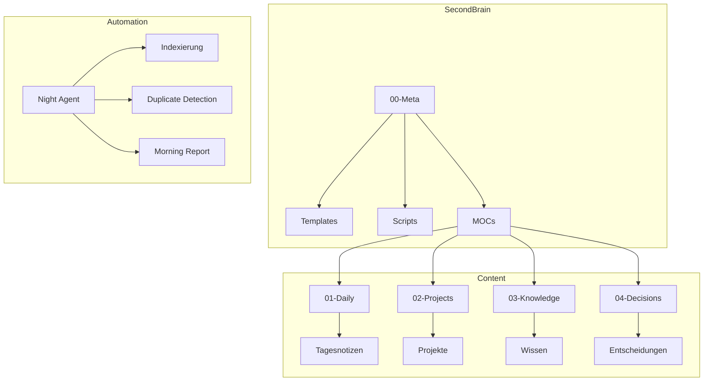

# ECC Framework Referenz

> **Dokumentation des ECC Second Brain Frameworks - Angepasst für unseren Vault**

**Quelle:** ECC Second Brain Framework v1.0.0  
**Original-Pfad:** `vault-archive/.../SecondBrain/README.md`  
**Anpassung:** Pfade und Struktur aktualisiert für unseren SecondBrain

---

## Tag-System (Übernommen)

| Tag | Farbe | Verwendung |
|-----|-------|------------|
| `#decision` | Indigo | Architekturentscheidungen |
| `#todo` | Amber | Offene Aufgaben |
| `#insight` | Emerald | Erkenntnisse |
| `#session` | Purple | Session-Logs |
| `#context` | Cyan | Kontext-Informationen |
| `#project` | Blue | Projektbezogen |
| `#area` | Rose | Bereichsbezogen |
| `#bug` | Red | Fehler/Dokumentation |
| `#workaround` | Orange | Temporäre Lösungen |

---

## Dataview Queries (Nutzbar)

### Offene TODOs
```dataview
TASK
FROM #todo
WHERE !completed
SORT priority DESC, dueDate ASC
```

### Aktive Projekte
```dataview
TABLE status, date
FROM "02-Projects/Active"
WHERE type = "project"
SORT date DESC
```

### Entscheidungen nach Status
```dataview
TABLE status, date, adr_id
FROM "04-Decisions"
WHERE type = "decision"
SORT date DESC
```

---

## YAML-Frontmatter Referenz

### Für Sessions/Daily Notes:
```yaml
---
date: DD-MM-YYYY
type: daily
tags: [daily, session]
source: "session-id"  # Optional: Original-Session-ID
---
```

### Für Projekte:
```yaml
---
date: DD-MM-YYYY
type: project
status: active  # active | paused | completed
tags: [project]
---
```

### Für Entscheidungen (ADRs):
```yaml
---
date: DD-MM-YYYY
type: decision
status: accepted  # proposed | accepted | rejected | deprecated
tags: [decision, adr]
adr_id: ADR-XXX
---
```

---

## Nützliche Obsidian-Plugins

### Empfohlen:
- **Dataview** - Dynamische Abfragen (bereits genutzt in unseren MOCs)
- **Templater** - Automatisierung für Templates
- **Git** - Versionierung des Vaults
- **Mermaid** - Diagramme (für Architektur-Doku)

### Optional:
- **Tag Wrangler** - Tag-Management
- **Folder Notes** - Ordner-Übersichten

---

## Architektur-Übersicht



---

## Unterschiede zum Original

| Aspect | Original ECC | Unser SecondBrain |
|--------|--------------|-------------------|
| **Pfad** | `Documents\\\*` | `.openclaw\workspace\SecondBrain\` |
| **Struktur** | 00-Inbox, 05-Daily | 00-Meta, 01-Daily |
| **Sync** | Automatisch (Plugin) | Manuell / Night Agent |
| **Setup** | Setup-Skript | Manuell erstellt |

---

## Was wir NICHT übernommen haben

- ❌ Automatischer Sync (zu instabil)
- ❌ ECC-Vault Plugin (nicht verfügbar)
- ❌ Winston Logging (zu komplex)
- ❌ Alte Pfade und Ordnerstruktur

---

## Verwandte Dokumente

- [[system_memory_vault_architektur|System: Memory & Vault Architektur]]
- [[project-vision-und-anforderungen|Projekt-Vision]]
- [[ADR-004-openclaw-architecture|ADR-004: Architektur-Entscheidungen]]

---

*Angepasst von: ECC Second Brain Framework v1.0.0*  
*Letzte Aktualisierung: 10-04-2026*
