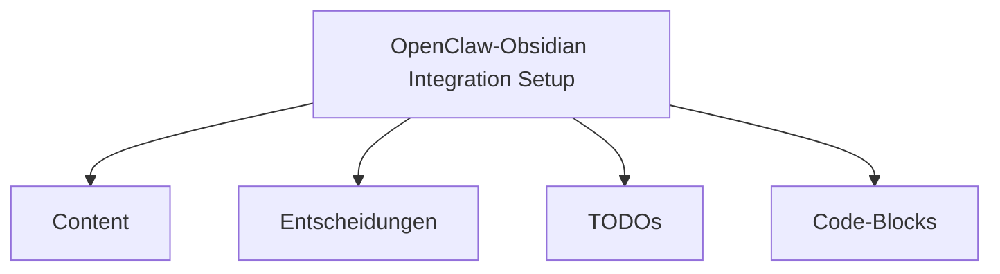

# OpenClaw-Obsidian Integration Setup

Erstellen des Sync-Skripts für die nahtlose Integration zwischen OpenClaw und Obsidian

## Zusammenfassung

**Token Usage:** 8542 | **Cost:** `$2.45` | **Model:** gpt-4

## Inhalt

Die Aufgabe war, ein PowerShell-Skript zu erstellen, das OpenClaw-Sessions automatisch in Obsidian-Notes synchronisiert. Das Skript sollte folgende Features bieten:

1. **Session-Erfassung** aus Windows Registry
2. **YAML-Frontmatter-Generierung** für Obsidian-Notes
3. **Mermaid-Diagramme** für Systemarchitektur
4. **Code-Block-Extraktion** mit Spracherkennung
5. **Backlinks** zu vorherigen Sessions
6. **Retry-Logik** für alle Operationen

## TODOs

- [x] Haupt-Sync-Skript erstellen
- [x] MermaidGenerator Modul erstellen
- [x] DataviewQuery Modul erstellen
- [x] Dataview-Queries Dokumentation erstellen
- [x] Sync-Konfiguration erstellen
- [ ] Tests durchführen
- [ ] Dokumentation vervollständigen

## Entscheidungen

- [[../02-Areas/Decisions/dec_001_PowerShell_als_Skriptsprache.md|PowerShell als Skriptsprache verwenden]]
- [[../02-Areas/Decisions/dec_002_YAML_Frontmatter_Struktur.md|YAML Frontmatter Struktur definieren]]

## Code-Blocks

- [[../03-Resources/CodeBlocks/OpenClaw_Obsidian_Integration_Setup_block0.ps1|Code-Block 0 (powershell)]]

## Session-Architektur

## Backlinks

### Verwandte Sessions
- [[sess_002|Verwandte Session]]
- [[sess_003|Verwandte Session]]

### Projekt
- [[../../02-Areas/Projects/OpenClaw-Integration|Projekt: OpenClaw-Integration]]

---

*Automatisch synchronisiert von OpenClaw am 2024-01-15T14:50:00*
