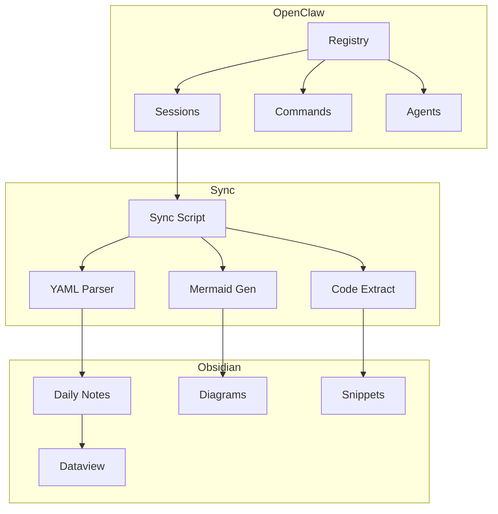

# ECC Second Brain Framework

## Overview

| Property | Value |
|----------|-------|
| **Project ID** | `PROJ-20260325-001` |
| **Status** | 🟢 Active |
| **Priority** | 🔴 High |
| **Start Date** | 2026-03-25 |
| **Due Date** | 2026-03-26 |
| **Completion** | 95% |

---

## Goal

Implementiere ein vollständiges ECC-Second-Brain-Framework mit Obsidian-Integration basierend auf dem aktuellen OpenClaw-Stand.

---

## Success Criteria

- [x] ECC-CORE mit Error-Handler und Logging
- [x] Obsidian-Integration mit Plugin
- [x] Second-Brain-Struktur (PARA)
- [x] Sync-Skript für OpenClaw
- [x] Stabilitätsmechanismen
- [x] Setup-README und Dokumentation

---

## Architecture

---

## Components

### 1. ECC-CORE
- Error-Handler mit Try-Catch
- Winston-Logger mit Datei-Rotation
- Eval-Runner mit CI-Template
- Backup/Restore-Kommandos
- Retry-Logik

### 2. Obsidian-Integration
- manifest.json mit ID "ecc-second-brain"
- data.json für Plugin-Einstellungen
- styles.css für ECC-Theme
- Daily-Notes-Template
- Tag-System

### 3. Second-Brain-Struktur
- 00-Inbox/ (neue Inputs)
- 01-Projects/ (aktive Projekte)
- 02-Areas/ (langfristige Bereiche)
- 03-Resources/ (Skills, Patterns, Snippets)
- 04-Archive/ (abgeschlossene Sessions)
- 05-Daily/ (tägliche Session-Logs)

### 4. Sync-Skript
- OpenClaw → Obsidian Sync
- Mermaid-Diagramme
- Code-Block-Extraktion
- Dataview-Queries
- Backlinks

### 5. Stabilität
- Drift-Detection
- Auto-Backup
- Context-Switches
- API-Key-Verschlüsselung

---

## Decisions #decision

### ADR-001: YAML vs JSON
**Decision:** YAML für Registry (menschenlesbar), JSON für Indizes (Performance)
**Rationale:** Best of both worlds

### ADR-002: File-based vs Database
**Decision:** Keine SQLite, file-basierte Registry
**Rationale:** Konsistent mit OpenClaw's Memory-System

---

## Notes

Framework basiert auf dem OpenClaw-Stand vom 2026-03-25.

---

*ECC Second Brain Framework Project*
