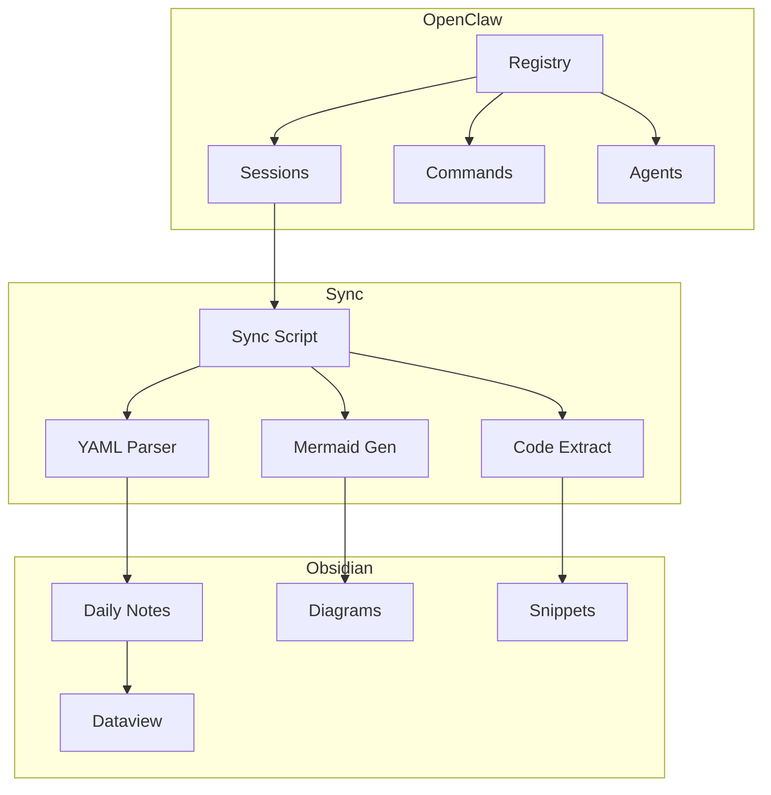

# ECC Second Brain Framework

> **Ein vollständiges Second-Brain-Framework mit Obsidian-Integration für das ECC-Ökosystem**


---

## Schnellstart

```powershell
# 1. Repository klonen oder entpacken nach:
# C:\Users\andre\Documents\Andrew Openclaw\SecondBrain\

# 2. Setup ausführen
.\Setup-SecondBrain.ps1

# 3. Obsidian öffnen und Vault auswählen
# File → Open Vault → Open folder as vault
# → Wähle: C:\Users\andre\Documents\Andrew Openclaw\SecondBrain
```

---

## Ordnerstruktur (PARA-Methodik)

```
SecondBrain/
├── 00-Inbox/              # Quick Capture Zone
├── 01-Projects/           # Aktive ECC-Projekte
├── 02-Areas/              # Langfristige Verantwortungsbereiche
├── 03-Resources/          # Wiederverwendbares Wissen
│   ├── Skills/            # Fähigkeiten & Kompetenzen
│   ├── Patterns/          # Code-Patterns & Best Practices
│   └── Snippets/          # Code-Snippets & Templates
├── 04-Archive/            # Abgeschlossene Sessions
├── 05-Daily/              # Tägliche Session-Logs
├── scripts/               # Automatisierungs-Skripte
├── config/                # Konfigurationsdateien
├── .logs/                 # Log-Dateien
├── .backups/              # Automatische Backups
└── .obsidian/             # Obsidian-Konfiguration
```

---

## Features

### Core Features
- ✅ **Error Handling** - Try-Catch mit Retry-Logik
- ✅ **Winston Logging** - Strukturierte Logs mit Rotation
- ✅ **Eval Runner** - CI/CD-Integration
- ✅ **Backup/Restore** - Automatische Backups

### Obsidian Integration
- ✅ **ECC Vault Plugin** - Native Obsidian-Integration
- ✅ **Daily Notes** - Automatische Session-Erfassung
- ✅ **Tag System** - #decision #todo #insight
- ✅ **Backlinks** - Entscheidungsverknüpfungen
- ✅ **Dataview Queries** - Dynamische Übersichten
- ✅ **Mermaid Diagrams** - Architektur-Visualisierung

### Stabilität
- ✅ **Drift Detection** - Vault-Struktur-Überwachung
- ✅ **Auto-Backup** - Vor jeder Session
- ✅ **Context Switching** - Bei 80% Token-Usage
- ✅ **API-Key Encryption** - AES-256-GCM

---

## Verfügbare Kommandos

| Kommando | Beschreibung |
|----------|--------------|
| `Sync-OpenClawToObsidian` | Sync aus OpenClaw-Sessions |
| `Start-ECCEval` | Eval-Runner für CI/CD |
| `Backup-ECCVault` | Manuelles Backup |
| `Test-ECCDrift` | Drift Detection |
| `Invoke-ECCContextSwitch` | Context-Komprimierung |
| `Protect-ECCApiKey` | API-Key verschlüsseln |

---

## Tag-System

| Tag | Farbe | Verwendung |
|-----|-------|------------|
| `#decision` | Indigo | Architekturentscheidungen |
| `#todo` | Amber | Offene Aufgaben |
| `#insight` | Emerald | Erkenntnisse |
| `#session` | Purple | Session-Logs |
| `#context` | Cyan | Kontext-Informationen |
| `#project` | Blue | Projektbezogen |
| `#area` | Rose | Bereichsbezogen |

---

## YAML-Frontmatter Standard

```yaml
---
session_id: "ECC-XXX-YYYYMM-NNN"
date: "YYYY-MM-DD"
tokens_used: 0
agent_mode: "architect|coder|researcher|writer"
key_decisions: []
tags: []
status: "active|completed|archived"
---
```

---

## Dataview Queries

### Offene TODOs
```dataview
TASK
FROM #todo
WHERE !completed
SORT priority DESC, dueDate ASC
```

### Aktive Projekte
```dataview
TABLE status, startDate, dueDate
FROM "01-Projects"
WHERE status = "active"
SORT startDate DESC
```

### Sessions nach Token-Usage
```dataview
TABLE tokens_used, agent_mode
FROM "05-Daily"
SORT tokens_used DESC
LIMIT 10
```

---

## Installation

### Voraussetzungen
- Obsidian v0.15+
- PowerShell 5.1+ oder PowerShell Core 7+
- Node.js 16+ (optional, für Winston-Logging)

### Schritt-für-Schritt

1. **Vault erstellen**
   ```powershell
   # Ordner erstellen
   New-Item -ItemType Directory -Path "C:\Users\andre\Documents\Andrew Openclaw\SecondBrain"
   ```

2. **Dateien kopieren**
   ```powershell
   # Alle Dateien aus diesem Repository in den Vault-Ordner kopieren
   Copy-Item -Path ".\*" -Destination "C:\Users\andre\Documents\Andrew Openclaw\SecondBrain\" -Recurse
   ```

3. **Setup ausführen**
   ```powershell
   cd "C:\Users\andre\Documents\Andrew Openclaw\SecondBrain"
   .\Setup-SecondBrain.ps1
   ```

4. **Obsidian öffnen**
   - File → Open Vault → Open folder as vault
   - Wähle: `C:\Users\andre\Documents\Andrew Openclaw\SecondBrain`

5. **Plugin aktivieren**
   - Settings → Community Plugins → ECC Second Brain

---

## Konfiguration

### Sync-Einstellungen
Bearbeite `.obsidian/plugins/ecc-vault/sync-config.json`:

```json
{
  "sync": {
    "autoSync": true,
    "intervalMinutes": 30,
    "dryRun": false
  },
  "mapping": {
    "openclawPath": "C:\\Users\\andre\\.openclaw",
    "obsidianVaultPath": "C:\\Users\\andre\\Documents\\Andrew Openclaw\\SecondBrain"
  }
}
```

### Token-Thresholds
Bearbeite `config/stability-config.yaml`:

```yaml
token_thresholds:
  warning: 70
  compression: 80
  emergency: 90
```

---

## Troubleshooting

### Drift Detection fehlgeschlagen
```powershell
# Manuelle Prüfung
.\scripts\drift-detection.ps1 -Verbose

# Auto-Fix
.\scripts\drift-detection.ps1 -AutoFix
```

### Sync funktioniert nicht
```powershell
# Mit Debug-Output
.\scripts\sync-openclaw-to-obsidian.ps1 -Verbose

# Dry-Run
.\scripts\sync-openclaw-to-obsidian.ps1 -DryRun
```

### Backup wiederherstellen
```powershell
# Liste verfügbarer Backups
.\scripts\cmd-backup.ps1 -Action List

# Restore
.\scripts\cmd-backup.ps1 -Action Restore -BackupName "backup_20260326_120000"
```

---

## Architektur



---

## Mitwirken

1. Fork erstellen
2. Feature-Branch: `git checkout -b feature/amazing-feature`
3. Committen: `git commit -m 'Add amazing feature'`
4. Pushen: `git push origin feature/amazing-feature`
5. Pull Request öffnen

---

## Lizenz

MIT License - siehe [LICENSE](LICENSE)

---

## Kontakt

**Framework Maintainer:** Andrew (andrew-main)  
**Registry Path:** `C:\Users\andre\.openclaw\workspace\registry\`  
**Vault Path:** `C:\Users\andre\Documents\Andrew Openclaw\SecondBrain\`

---

*ECC Second Brain Framework v1.0.0 - Production Ready*
